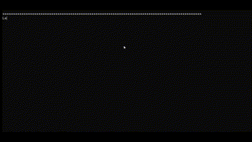

# Armil Land 🎮

**Un RPG testuale sviluppato in C++ con programmazione a oggetti.**

## 🔹 Descrizione
Armil Land è un gioco di ruolo testuale dove i giocatori affrontano battaglie strategiche, sviluppano abilità e avanzano di livello. Il codice è scritto interamente in C++, sfruttando il paradigma della programmazione a oggetti.

## 🛠 Tecnologie Utilizzate
- **Linguaggio:** C++
- **Paradigma:** Programmazione a oggetti
- **Gestione file:** Salvataggio progressi
- **Interfaccia:** Testuale con barra della vita dinamica

## 🎯 Funzionalità Principali
- Sistema di combattimento bilanciato con 4 classi
- Progressione del personaggio (livelli e abilità)
- Salvataggio della partita / Caricamento della partita
- Algoritmi per il bilanciamento dei nemici

## 🚀 Installazione e Avvio
Per eseguire Armil Land, compila il codice sorgente con il seguente comando:
g++ -o ArmilLand ArmilLand.cpp
./ArmilLand

## 🎮 Come giocare
- Seleziona una classe per il tuo personaggio.
- Affronta nemici strategicamente, sfruttando abilità e oggetti.
- Ogni vittoria ti permette di avanzare di livello e migliorare le statistiche.
- Usa il sistema di salvataggio per continuare la tua avventura in un secondo momento.

## 📜 Licenza
Questo progetto è protetto da Creative Commons, quindi può essere visualizzato ma non modificato senza autorizzazione.

## ✨ Autore
Creato con passione da Alessandro, aspirante sviluppatore e amante della programmazione in C++.

## 🔥 Obiettivi futuri
- Implementare una GUI per un'interfaccia più avanzata
- Aggiungere più classi e abilità speciali
- Creare un sistema multiplayer online
- Introdurre un sistema di quest procedurali

## 🤝 Contributi
Se vuoi migliorare Armil Land, sentiti libero di aprire una pull request! 💡

